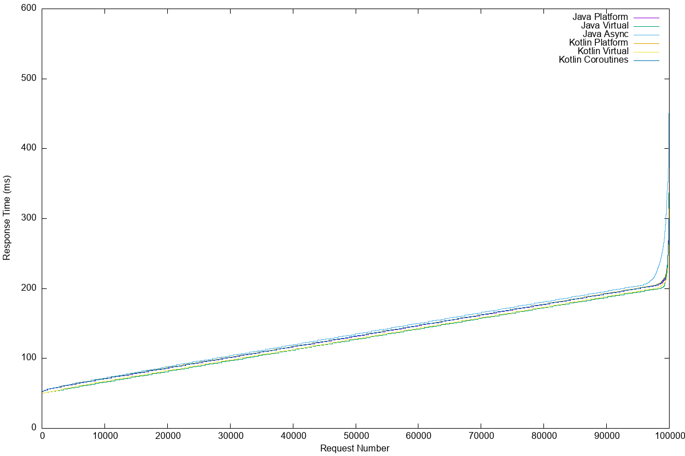

# Thread Performance Comparison: Java vs Kotlin

This project demonstrates performance differences between various threading models in Spring Boot applications using Java and Kotlin.

## Threading Models Tested

1. **Java Platform Threads (Synchronous)** - Traditional blocking I/O with platform threads
2. **Java Virtual Threads (Synchronous)** - JDK 21 virtual threads with blocking I/O
3. **Java Asynchronous** - CompletableFuture with platform threads
4. **Kotlin Platform Threads (Synchronous)** - Traditional blocking I/O with platform threads
5. **Kotlin Virtual Threads (Synchronous)** - JDK 21 virtual threads with blocking I/O
6. **Kotlin Coroutines** - Kotlin suspend functions with non-blocking I/O

## Prerequisites

- **JDK 21** (required for virtual threads)
- **Maven 3.6+**
- **Apache Bench (ab)** for load testing
- **curl** for health checks

### Installing Apache Bench

**Ubuntu/Debian:**
```bash
sudo apt-get update
sudo apt-get install apache2-utils
```

**macOS:**
```bash
brew install apache2
```

**Windows:**
```bash
# Use WSL or download Apache HTTP Server binaries
```

## Project Structure

```
src/
├── main/
│   ├── java/
│   │   └── cool/cfapps/performancedemo/
│   │       ├── PerformanceDemoApplication.java
│   │       ├── config/
│   │       │   ├── ThreadConfiguration.java
│   │       │   └── JacksonConfiguration.java
│   │       ├── service/
│   │       │   └── JavaBusinessService.java
│   │       └── controller/
│   │           └── JavaController.java
│   └── kotlin/
│       └── cool/cfapps/performancedemo/
│           ├── service/
│           │   └── KotlinBusinessService.kt
│           └── controller/
│               ├── DiagnosticController.java
│               └── KotlinController.kt
└── test/
```

## Quick Start

### 1. Build the Application
```bash
mvn clean package
```

### 2. Run Performance Tests

#### Option A: Automated Testing (Recommended)
```bash
# Make script executable
chmod +x test-performance.sh

# Run all tests
./test-performance.sh
```

#### Option B: Manual Testing
```bash
# Test Java Platform Threads
java -jar target/performance-demo-1.0.0.jar --spring.profiles.active=platform-threads &
ab -n 100000 -c 100 http://localhost:8080/java/sync?input=test

# Test Java Virtual Threads
pkill -f performance-demo
java -jar target/performance-demo-1.0.0.jar --spring.profiles.active=virtual-threads &
ab -n 100000 -c 100 http://localhost:8080/java/virtual?input=test

# Test Kotlin Coroutines
pkill -f performance-demo
java -jar target/performance-demo-1.0.0.jar --spring.profiles.active=platform-threads &
ab -n 100000 -c 100 http://localhost:8080/kotlin/coroutine?input=test
```

## Available Endpoints

### Java Endpoints
- `GET /java/sync` - Synchronous processing with platform threads
- `GET /java/async` - Asynchronous processing with CompletableFuture
- `GET /java/virtual` - Synchronous processing with virtual threads
- `GET /java/health` - Health check

### Kotlin Endpoints
- `GET /kotlin/sync` - Synchronous processing with platform threads
- `GET /kotlin/coroutine` - Coroutine-based processing
- `GET /kotlin/virtual` - Synchronous processing with virtual threads
- `GET /kotlin/health` - Health check

### Monitoring Endpoints
- `GET /actuator/health` - Application health
- `GET /actuator/metrics` - Application metrics
- `GET /actuator/threaddump` - Thread dump

## Expected Performance Characteristics

### Platform Threads (Java/Kotlin Sync)
- **Throughput**: Low to medium (limited by thread pool size)
- **Memory**: High (each thread uses ~1MB stack)
- **Latency**: Medium (thread context switching overhead)
- **Scalability**: Limited (typically max 200-500 threads)

### Virtual Threads (Java/Kotlin Virtual)
- **Throughput**: High (millions of virtual threads possible)
- **Memory**: Low (virtual threads use ~1KB)
- **Latency**: Low (minimal context switching)
- **Scalability**: Excellent (handles blocking I/O efficiently)

### CompletableFuture (Java Async)
- **Throughput**: Medium to high (non-blocking with thread reuse)
- **Memory**: Medium (limited by thread pool)
- **Latency**: Low to medium
- **Scalability**: Good (better thread utilization)

### Kotlin Coroutines
- **Throughput**: High (non-blocking, cooperative)
- **Memory**: Very low (coroutines are lightweight)
- **Latency**: Very low (no thread blocking)
- **Scalability**: Excellent (millions of coroutines possible)

## Sample Test Results Analysis

### Typical Results (100K requests, 500 concurrent)

| Implementation    | RPS  | Mean Latency (ms) | 95th Percentile (ms) | Memory Usage |
|-------------------|------|-------------------|----------------------|--------------|
| Java Platform     | 3761 | 132               | 200                  | High         |
| Java Virtual      | 3894 | 128               | 195                  | Low          |
| Java Async        | 3730 | 134               | 201                  | Medium       |
| Kotlin Platform   | 3723 | 134               | 200                  | High         |
| Kotlin Virtual    | 3861 | 129               | 196                  | Low          |
| Kotlin Coroutines | 3719 | 134               | 200                  | Very Low     |

*Note: Actual results depend on hardware, JVM settings, and system load*


## Monitoring During Tests

### Real-time Thread Monitoring
```bash
# Monitor active threads
watch -n 1 'curl -s http://localhost:8080/actuator/metrics/jvm.threads.live | grep -o "\"value\":[0-9]*" | cut -d: -f2'

# Monitor heap usage
watch -n 1 'curl -s http://localhost:8080/actuator/metrics/jvm.memory.used | grep -A5 heap'
```

### System Resources
```bash
# Monitor CPU and memory Linux
top -p $(pgrep -f performance-demo)

# Monitor CPU and memory MacOS
top -pid $(pgrep -f performance-demo)

# Detailed JVM monitoring
jstat -gc $(pgrep -f performance-demo) 1s
```

## Configuration Tuning

### Platform Threads Profile
```yaml
spring:
   config:
      activate:
         on-profile: platform-threads
   task:
      execution:
         pool:
            core-size: 200
            max-size: 500
            queue-capacity: 1000

server:
   tomcat:
      threads:
         max: 500
         min-spare: 50
```

### Virtual Threads Profile
```yaml
# Profile for virtual threads
spring:
   config:
      activate:
         on-profile: virtual-threads
   threads:
      virtual:
         enabled: true

# Virtual threads configuration
server:
   tomcat:
      threads:
         max: 2000
         min-spare: 100
```

## Troubleshooting

### Common Issues

1. **Port Already in Use**
   ```bash
   lsof -i :8080
   kill -9 <PID>
   ```

2. **Out of Memory Errors**
   ```bash
   java -Xmx2G -jar target/performance-demo-1.0.0.jar
   ```

3. **Too Many Open Files**
   ```bash
   ulimit -n 10000
   ```

4. **Connection Refused Errors**
    - Increase server thread pool size
    - Reduce ab concurrency level
    - Check application logs

### Performance Optimization Tips

1. **JVM Tuning**
   ```bash
   java -XX:+UseG1GC -XX:MaxGCPauseMillis=200 -Xmx4G -jar app.jar
   ```

2. **Virtual Thread Optimization**
   ```bash
   java -Djdk.virtualThreadScheduler.parallelism=16 -jar app.jar
   ```

3. **Tomcat Tuning**
   ```yaml
   server:
     tomcat:
       accept-count: 1000
       max-connections: 10000
   ```

## Results Visualization

The test script generates `.dat` files that can be used with gnuplot:

```bash
gnuplot -e "
set terminal png size 1200,800;
set output 'response_times.png';
set xlabel 'Request Number';
set ylabel 'Response Time (ms)';
plot 'java_sync_platform_gnuplot.dat' using 9 with lines title 'Java Platform',
     'java_sync_virtual_gnuplot.dat' using 9 with lines title 'Java Virtual',
     'java_async_platform_gnuplot.dat' using 9 with lines title 'Java Async',
     'kotlin_sync_platform_gnuplot.dat' using 9 with lines title 'Kotlin Platform',
     'kotlin_sync_virtual_gnuplot.dat' using 9 with lines title 'Kotlin Virtual',
     'kotlin_coroutines_gnuplot.dat' using 9 with lines title 'Kotlin Coroutines'
     
"
```
Response Time Comparison


## Contributing

Feel free to extend this benchmark with additional test scenarios:
- Different payload sizes
- Database connections
- External API calls
- WebFlux reactive endpoints

## License

This project is for educational and benchmarking purposes.